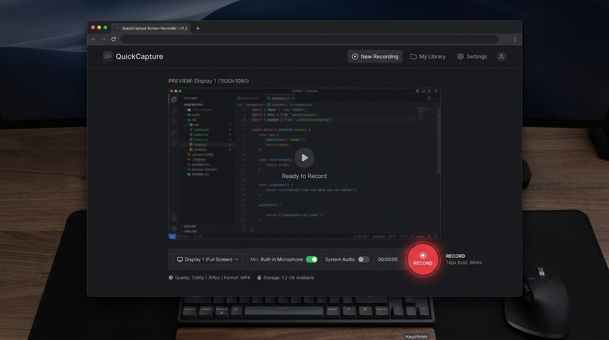

# 🎥 Super-Lite Screen Recorder

<div align="center">
  
  
  
  
</div>

<br>

<br>

<div align="center">
  
  <br><br>
  <a href="https://jpXproject.github.io/lite-screen-recorder/Rekam-Layar-Lite.html">
    
  </a>

</div>

**Super-Lite Screen Recorder** adalah utilitas perekam layar mandiri (*standalone*) berkinerja tinggi yang dirancang khusus untuk bekerja tanpa perangkat lunak kelas berat (seperti OBS Studio). Dibangun menggunakan kapabilitas asli WebRTC HTML5 (*Screen Capture API*) dan diluncurkan melalui server lokal (*localhost*) untuk menembus aturan *Secure Context* di browser modern.

<div align="center">
  <b>Hasil Rekaman Asli (Tanpa Lag):</b><br>
  <video src="https://github.com/jpXproject/lite-screen-recorder/raw/master/assets/jpXCode_ScreenRecord_1787919828.webm" controls="controls" muted="muted" width="100%" style="border-radius:12px; border:1px solid #444; max-width:800px;"></video>
</div>

---

## ✨ Fitur Utama

- 🪶 **Sangat Ringan (Zero-Bloatware)**: Tidak membebani memori maupun CPU. Sempurna untuk komputer spesifikasi rendah.
- 🚀 **Plug & Play**: Tanpa instalasi Node.js, NPM, atau FFmpeg.
- 🔒 **Bypass Secure Context**: Telah dilengkapi dengan peluncur otomasi `.bat` untuk menciptakan *environment* HTTP `localhost` (persyaratan wajib browser untuk merekam layar).
- 📹 **Target Multi-Layar**: Mendukung perekaman *Full Screen*, Jendela Aplikasi spesifik, atau Tab Browser.
- 💾 **Auto-Save Instan**: Langsung menyimpan ke format video yang dikompres dengan baik begitu Anda menekan tombol "Berhenti".

---

## 🛠️ Persyaratan Sistem

- Python 3.x terinstal di *environment variable* (untuk server lokal).
- Browser Web berbasis Chromium (Google Chrome, Edge, Brave, dll).
- OS Windows (untuk mengeksekusi launcher `.bat`).

---

## 🚀 Panduan Penggunaan

### Mode Otomatis (Windows)
1. Kloning (*clone*) atau *download* folder ini.
2. Buka folder repositori di Explorer.
3. Klik ganda pada file `Buka-Perekam-Layar.bat`.
4. *Command Prompt* akan terbuka sesaat untuk mengaktifkan *port* 8765, lalu browser utama Anda akan langsung memuat UI perekam layar.
5. Klik **"Mulai Rekam Layar"**. File video akan terunduh otomatis saat rekaman dimatikan.

### Mode Manual (Linux / macOS / CLI)
Bagi pengguna UNIX atau *power user* yang ingin menjalankan dari terminal:
```bash
# 1. Hidupkan server HTTP Python
python3 -m http.server 8765

# 2. Buka link ini di browser Anda
http://localhost:8765/Rekam-Layar-Lite.html
```

---

## 📂 Struktur Direktori

```text
📦 Lite-Screen-Recorder
 ┣ 📜 Rekam-Layar-Lite.html       # Engine Perekam Layar (UI & Logika JS)
 ┣ 📜 Buka-Perekam-Layar.bat      # Launcher Windows (Localhost Binder)
 ┗ 📜 README.md                   # Dokumentasi repositori ini
```

---

## 🛡️ Keamanan & Privasi 

Proyek ini 100% dieksekusi di sisi-klien (*Client-Side Rendering*). Seluruh proses pengambilan *stream* video terjadi secara statis di perangkat lokal Anda. Tidak ada data, log, maupun piksel video yang dikirimkan ke server eksternal manapun.

---
<div align="center">
  <i>Dikembangkan oleh jpXCode Studio</i>
</div>


