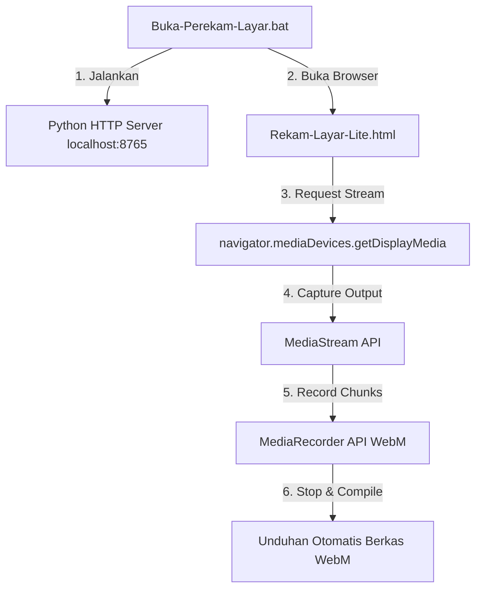

# 🎥 Lite Screen Recorder

<div align="center">
  
  
  
  
</div>

<br>

<div align="center">
  
  <br><br>
  <a href="https://jpXproject.github.io/lite-screen-recorder/Rekam-Layar-Lite.html">
    
  </a>
</div>

---

## 📖 Deskripsi Proyek
**Lite Screen Recorder** adalah utilitas perekam layar berbasis web mandiri (*standalone*) berkinerja tinggi yang dirancang untuk kebutuhan perekaman instan tanpa dependensi perangkat lunak pihak ketiga yang berat (seperti OBS Studio). Memanfaatkan API bawaan browser modern, aplikasi ini menawarkan fungsionalitas perekaman berkecepatan tinggi dengan overhead sistem minimal.

Untuk memfasilitasi penggunaan lokal secara aman (bypass batasan *Secure Context* WebRTC), proyek ini menyertakan skrip otomatisasi peluncuran lokal berbasis server HTTP internal Python.

---

## 🛠️ Analisis Arsitektur & Teknologi

Aplikasi ini dibangun menggunakan arsitektur minimalis tanpa framework (Zero-Dependency) untuk menjamin pemrosesan tercepat:



### Stack Teknologi Utama:
*   **MediaStream API & Screen Capture API**: Mengakses video dan audio sistem langsung melalui sandbox browser yang aman.
*   **MediaRecorder API**: Mengompresi dan merekam data stream secara realtime ke dalam fragmen memori.
*   **Python HTTP Server**: Menyediakan wrapper secure context (`http://localhost`) secara instan untuk melewati pembatasan keamanan browser pada API sensor/perangkat eksternal.

---

## ✨ Fitur Utama

*   🪶 **Ultra-Lightweight (Zero-Bloat)**: Mengonsumsi memori dan daya CPU yang sangat rendah, optimal untuk perangkat berspesifikasi rendah.
*   🚀 **Instan Tanpa Instalasi**: Tidak membutuhkan instalasi dependensi runtime eksternal seperti Node.js, NPM, Docker, maupun FFmpeg.
*   🔒 **Local Secure Context Bypass**: Dilengkapi launcher otomatis `.bat` untuk memetakan file statis ke port localhost guna mengaktifkan API `getDisplayMedia`.
*   📹 **Fleksibilitas Rekam**: Mendukung pemilihan area rekam: Seluruh layar (*Entire Screen*), Jendela Aplikasi (*Application Window*), atau Tab Browser spesifik.
*   💾 **Auto-Save Instan**: Secara otomatis merakit fragmen video menjadi berkas `.webm` yang terkompresi dan mengunduhnya begitu proses perekaman dihentikan.

---

## 📂 Struktur Repositori

```text
📦 lite-screen-recorder
 ┣ 📂 assets                      # Aset grafis demo dan media repositori
 ┣ 📜 Rekam-Layar-Lite.html       # Inti aplikasi (Struktur HTML, Styling CSS, Logika Perekaman JS)
 ┣ 📜 Buka-Perekam-Layar.bat      # Windows batch script launcher (Localhost Binder)
 ┗ 📜 README.md                   # Dokumentasi teknis proyek
```

---

## 🚀 Panduan Instalasi & Penggunaan

### 1. Prasyarat Sistem
*   Python 3.x terinstal dan terdaftar di *Environment Variable* (PATH) sistem operasi Anda.
*   Browser web modern berbasis engine Chromium (Google Chrome, Microsoft Edge, Opera, Brave, dll).

### 2. Cara Menjalankan

#### **Mode Otomatis (Sistem Operasi Windows)**
1. Unduh atau klon repositori ini.
2. Masuk ke direktori repositori.
3. Klik ganda berkas **`Buka-Perekam-Layar.bat`**.
4. Konsol CLI akan aktif di latar belakang (port 8765) dan browser utama Anda secara otomatis akan membuka antarmuka perekam layar.
5. Tekan tombol **"Mulai Rekam Layar"**, pilih layar target, lalu lakukan aktivitas Anda.
6. Klik **"Berhenti & Simpan Video"** untuk mengakhiri sesi dan menyimpan berkas video secara otomatis.

#### **Mode Manual (macOS / Linux / Terminal)**
Jika Anda menggunakan sistem operasi non-Windows atau ingin menjalankannya secara manual dari CLI, jalankan perintah berikut:
```bash
# 1. Aktifkan server HTTP bawaan Python di direktori proyek
python -m http.server 8765

# 2. Akses aplikasi melalui browser Anda
open http://localhost:8765/Rekam-Layar-Lite.html
```

---

## 🛡️ Privasi & Keamanan Data
Aplikasi ini berjalan sepenuhnya pada sisi klien (*100% Client-Side Processing*). Tidak ada API backend eksternal, telemetri, tracker, atau transmisi jaringan keluar yang digunakan. Seluruh manipulasi piksel media terjadi di memori lokal RAM sistem Anda dan langsung diunduh ke ruang penyimpanan lokal Anda.

---

<sub><p align="right"><sup>*Signature: jpXCode Studio (jpXproject), 2026.*</sup></p></sub>


